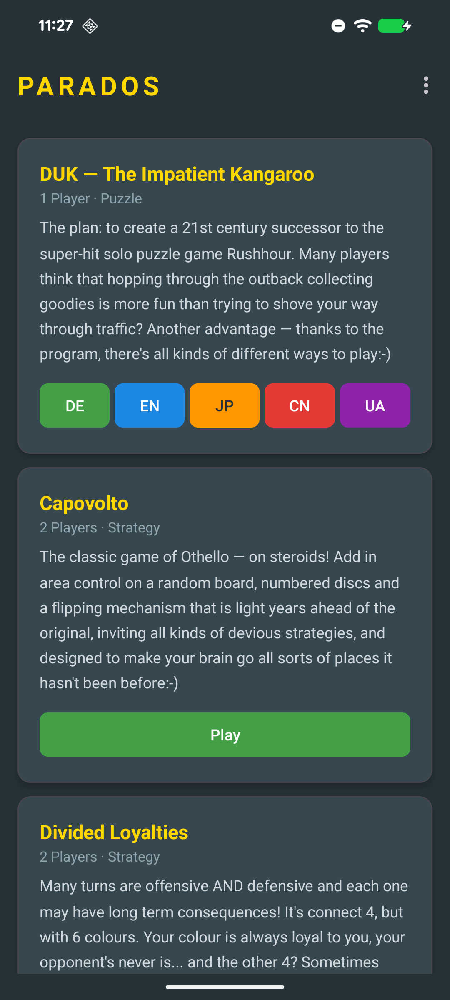
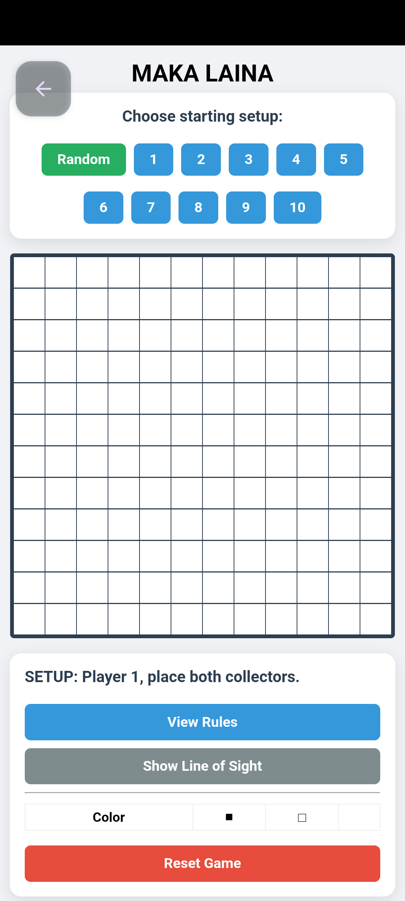
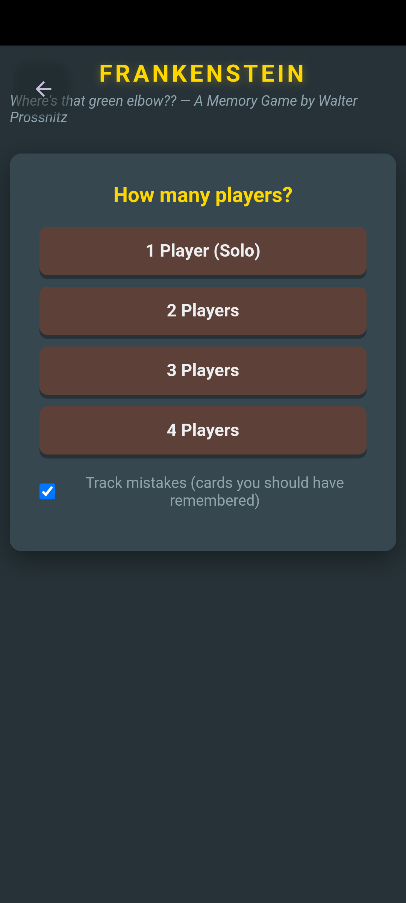

# Parados Android

Android App für die [Parados Board Games](https://game.ywesee.com/parados/) von Walter Prossnitz.

## Features

- Alle Parados-Spiele nativ auf Android spielbar (WebView)
- Offline-Gameplay — kein Internet nötig
- Remote-Multiplayer-Spiele öffnen im System-Browser (PeerJS/WebRTC benötigt HTTPS)
- Spiele-Updates direkt von GitHub via Menü
- Optimiert für verschiedene Android-Bildschirmgrössen
- Vollbild-Modus beim Spielen — Zurück-Button blendet sich nach 3s aus, Tap zum Einblenden
- Swipe vom linken Rand nach rechts zum Zurückkehren ins Menü
- Spielstand bleibt erhalten beim Wechsel ins Menü
- CSV-Export: Spieldaten als CSV-Datei teilen (via Android Share Sheet)
- CSV-Import: CSV-Dateien direkt im Spiel laden (via File Chooser)
- App-Icon: Känguru (kangy) — identisch mit der iOS-Version

## Spiele

- **DUK — The Impatient Kangaroo** (DE, EN, JP, CN, UA)
- **Capovolto** — Othello on steroids
- **Divided Loyalties** — Connect 4 mit 6 Farben
- **Democracy in Space** (Local, Remote)
- **Frankenstein** — Memory für 1–4 Spieler
- **Rainbow Blackjack** (DE, EN, Remote)
- **MAKA LAINA** (Local, Remote)

## Google Play

- **Play Store Icon**: `screenshots/play_store_icon_512x512.png` (512×512, kangaroo on beige background)
- **Package**: `com.ywesee.parados`

## Screenshots

| Game List | DUK Kangaroo | Capovolto |
|-----------|-------------|-----------|
|  |  |  |

| Divided Loyalties | MAKA LAINA | Frankenstein |
|-------------------|------------|--------------|
|  |  |  |

## Build

```bash
# Debug build
ANDROID_HOME=~/Android/Sdk ./gradlew assembleDebug

# Release bundle (for Google Play)
ANDROID_HOME=~/Android/Sdk ./gradlew bundleRelease
```

## Release & Upload

Release signing is configured via `signing.properties` (not tracked in git):

```properties
STORE_FILE=privateKeyParados.store
STORE_PASSWORD=your_password
KEY_ALIAS=your_alias
KEY_PASSWORD=your_key_password
```

Upload to Google Play (publishes directly as a production release):

```bash
./apkup_bundle
```

## Lizenz

GPLv3 — siehe [LICENSE](LICENSE)
